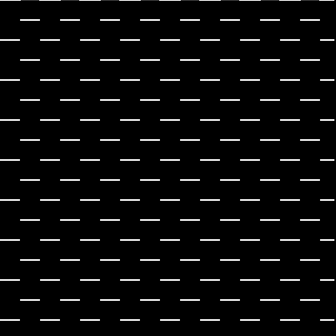
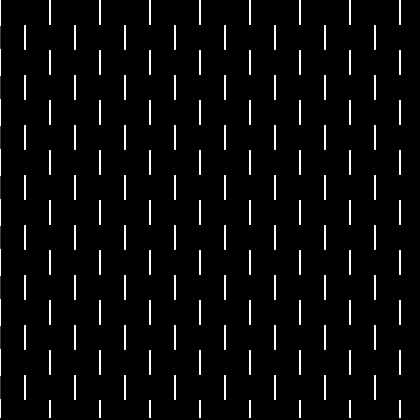
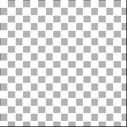
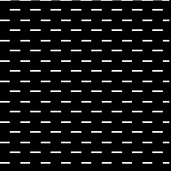
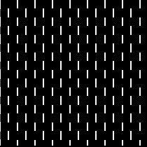
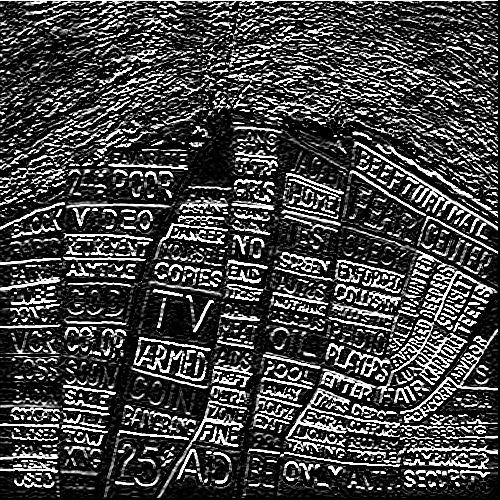
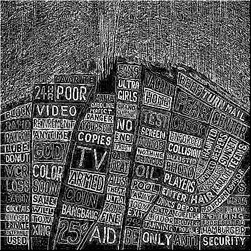
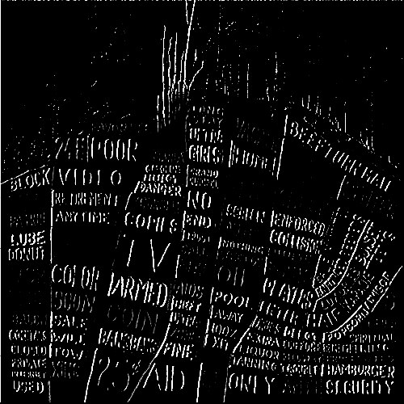
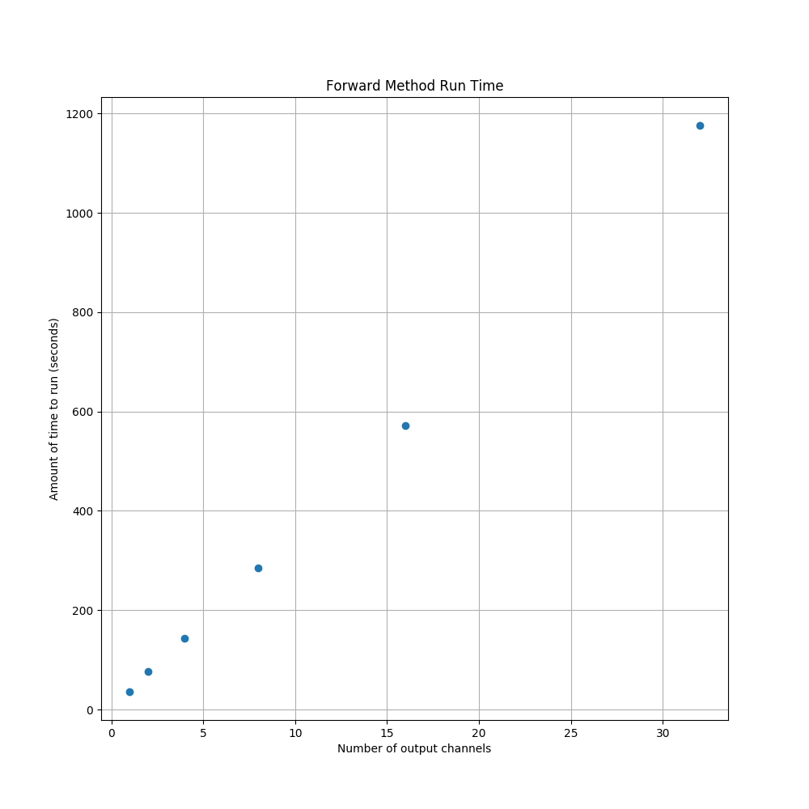
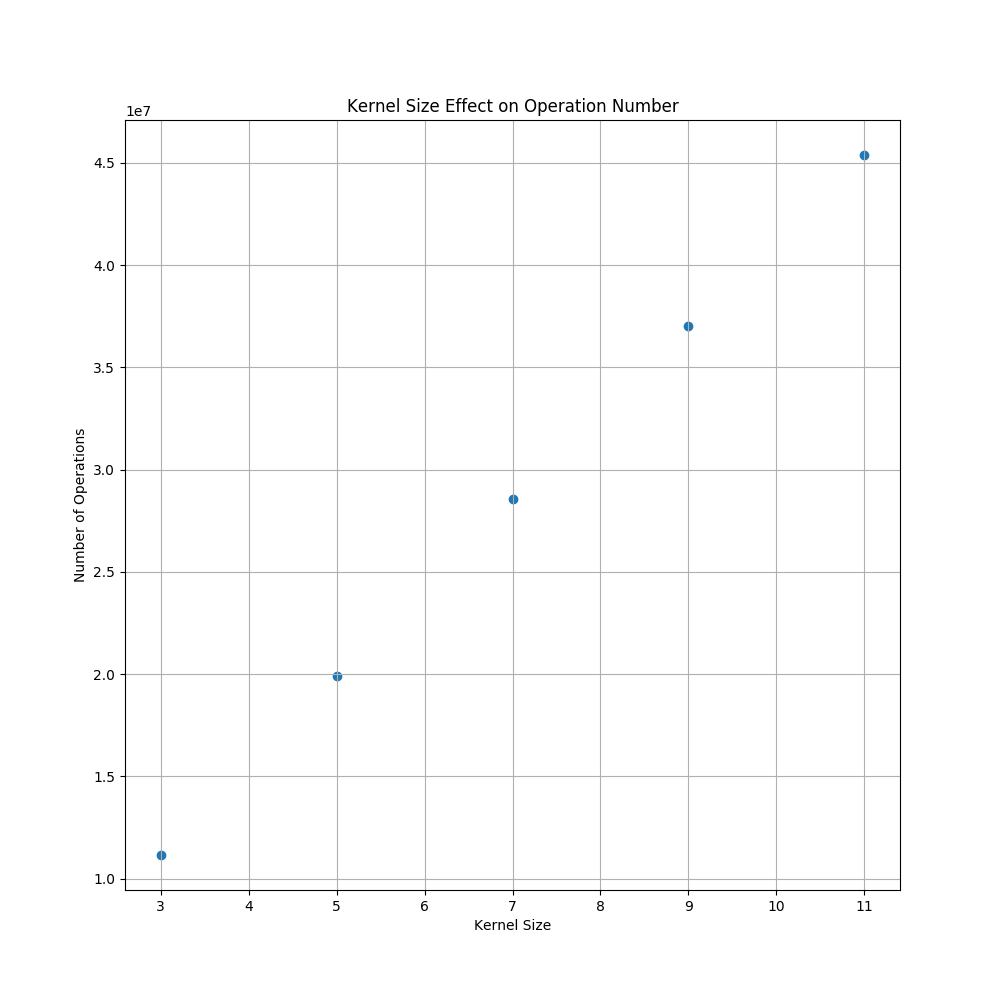

<h1>Assignment 1</h1>

This is a repository built to hold all of the work for the first assignment in BME 495. The
assignment addresses convolutions within a neural network so it is mostly an exercise in utilizing
object-oriented programming in order to do image convolution.

<h3>List of Files and Directories Contained</h3>
<ul>
    <li>conv.py</li>
    <li>main.py</li>
    <li>Assignment1.ipynb</li>
    <li>(directory) images</li>
    <li>(directory) results</li>
</ul>

<h3>Description of Files and Directories</h3>
<strong>conv.py</strong>

Contains the definition of the Conv2D class used in this assignment. Contains __init__ method as
well as forward method. Init method serves to instantiate an object of class Conv2D, while the
forward method takes an image as input and returns both a resultant tensor of convoluting this
image as well as a count of the number of operations necessary to perform this convolution.

<strong>main.py</strong>

Used to instantiate Conv2D objects. Instantiation typically takes the form:

 

conv2d = Conv2D(in_channel=1,o_channel=1,kernel_size=3,stride=1,mode='known')

Also serves the purpose of timing and plotting tasks 8 and 9 for this assignment. 

<strong>Assignment1.ipynb</strong>

A Jupyter Notebook created for a bit more ease of use and freedom within this assignment. 
Similar to the actual main.py and conv.py operation of class instantiation, but the mode argument has been changed
to a verbal description of the kind of convolution that we want to perform. This will be updated in 
the near future to hopefully be able to perform every convolution from wikipedia's 
article on <a src="https://en.wikipedia.org/wiki/Kernel_(image_processing)">image convolution.</a>

<strong>images</strong>

Directory that holds all of the source images that we will be convolving. Images can be added to here as seen 
fit based on forking this repository. Currently the only images in it are the provided checkerboard image for
the assignment and the album artwork for Radiohead's 2003 album Hail to the Thief.

<strong>results</strong>

Where output images are stored both from the Jupter Notebook as well as the main.py script.

<h1>Assignment Report</h1>
<h3>Task 1</h3>
</img>
<h3>Task 2</h3>
</img>
<h3>Task 3</h3>
</img>
<h3>Task 4</h3>
</img>
<h3>Task 5</h3>
</img>
<h3>Task 6</h3>
</img>
<h3>Task 7</h3>
</img>
</img>
<h3>Task 8</h3>
</img>
<h3>Task 9</h3>
</img>
