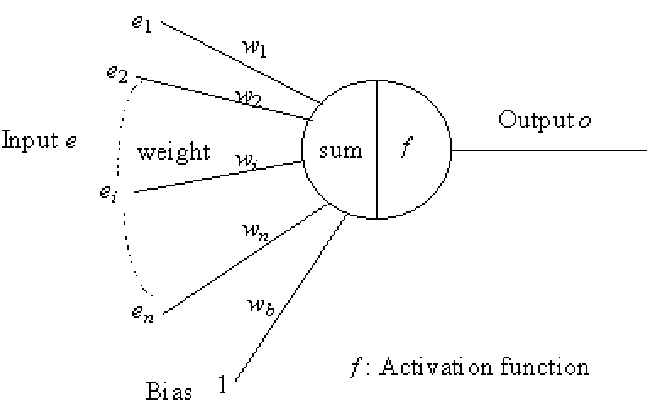
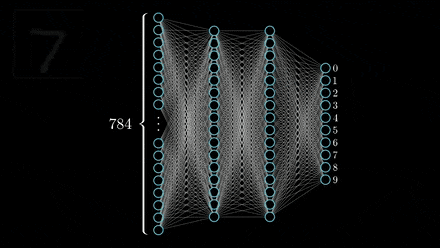
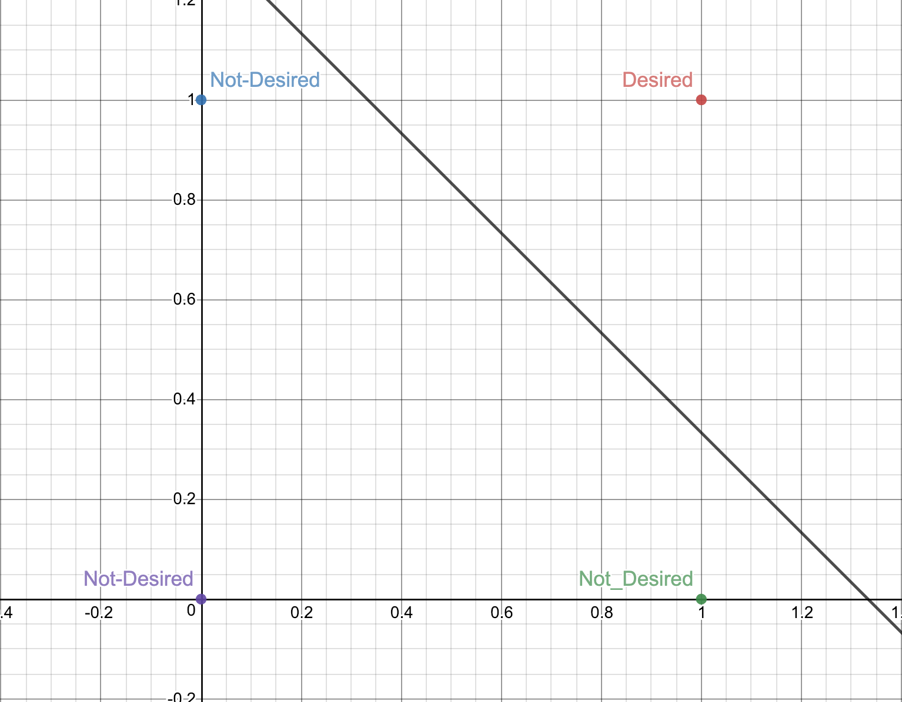
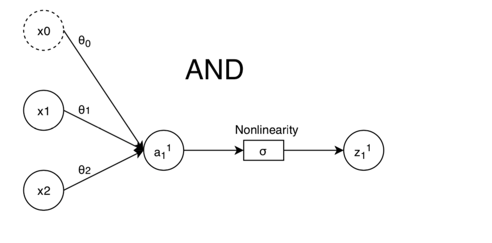
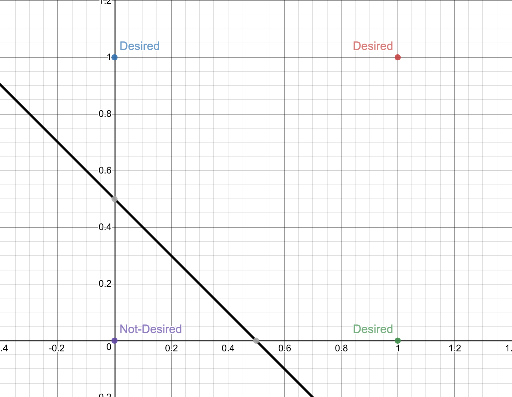
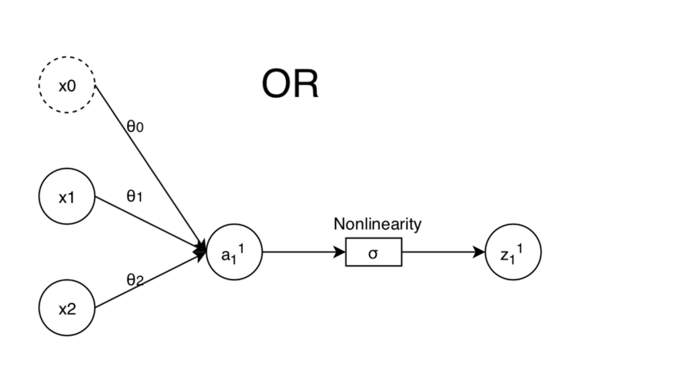
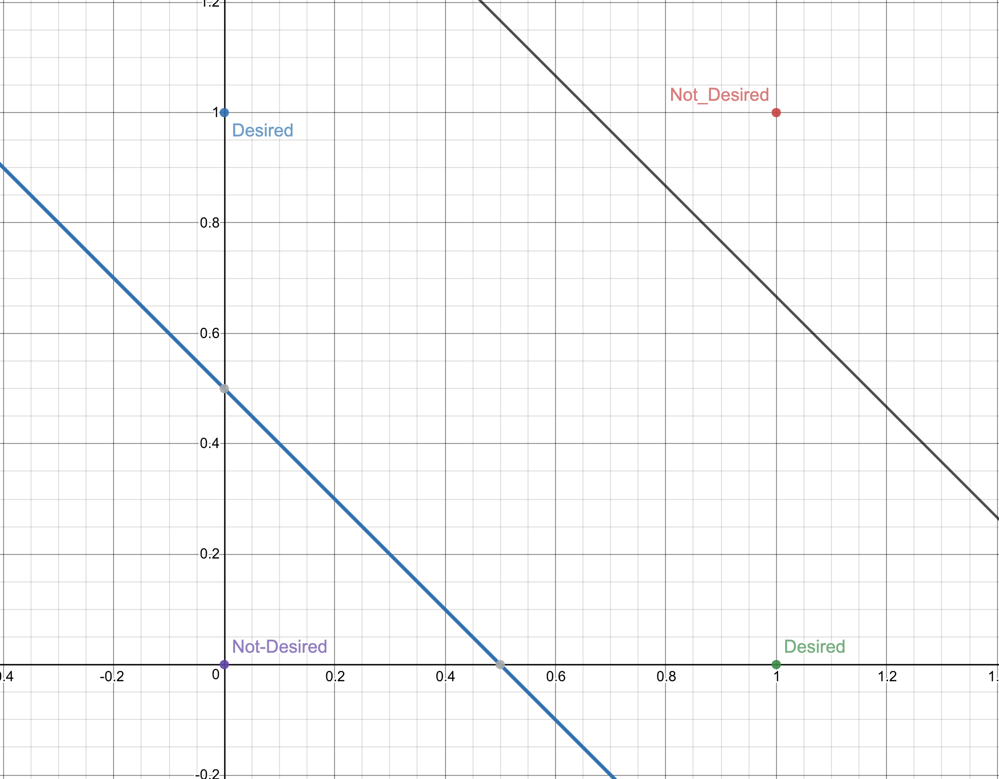
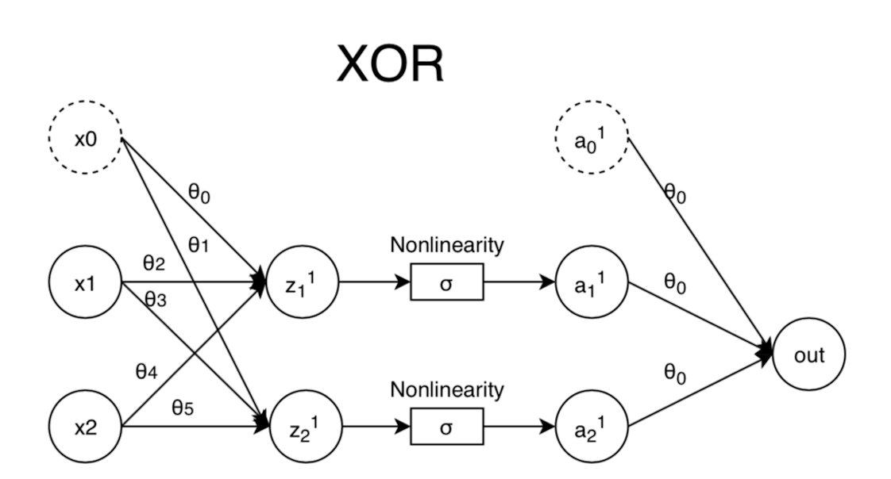

<h1>BME 495 Assignment 2</h1>

<h2>Neural Network Forward Pass Background</h2>

An important understanding for the creation of a neural network is where the term "Neural Network" comes from. Understanding this will lend itself right into this assignment and our understanding of neural networks. The easiest place to begin is to understand what the fundamental unit of a neural network, and indeed any neural circuit/system, is: the neuron. A neuron is a type of cell in the human body known for its ability to transmit signals either from within a system as in a motor neuron telling a muscle to move, or a sensory neuron that conveys information to the central nervous system for processing. For the analogy to carry over to a neural network in programming we have to consider the latter--a neuron that transmits sensory information inwards where we take a very complicated external world and create something that our brains can grasp relatively easily in the form of our five senses. An individual sensory neuron is able to take a specific amount of inputs and convert them into a signal to transmit through the body carrying information. This signal is built from the inputs to the neuron as a weighted sum of inputs. Between one's finger and spinal column there are a multitude of such sensory neurons, all gathering information from each neuron in the layer before them. At any given layer on the way to the central nervous system a neuron can decide to fire or not fire. This decision comes as a result of this weighted sum. A neuron takes every one of its inputs multiplied by a certain weight factor and decides if it wants to keep transmitting a signal or what the transmitted signal should be from there. A repesentative drawing of this is shown below.

From this biological simplification researchers were able to create the interesting data structure of a <i>perceptron</i>. The perceptron is an artificial model of a biological neuron used for processing data as its inputs and creating a weighted sum output based on an activation function. A simplified model of a perceptron approximating a biological neuron is shown below.

The goal of this assignment is to create a network of such perceptrons. We want to be able to take an input of some specific number of elements, send it through a network of layers of perceptrons, summing and multiplying inputs all the way, until we reach a specific output shape that we are looking for. We want to be able to designate only the number of elements in each layer and get an output based on random weights. The network will necessarily have some funky behavior since specific weights for neurons are very important in Deep Learning (Assignment 3 here we come), but this will be a good representation of the idea of what is known as a <i>forward pass</i> of a neural network. A gif of a forward pass is shown below to give a graphical idea of what this assignment will be accomplishing.

<h2>Logic Gates</h2>

One useful test of a simple forward pass of a neural network is the creation of a very simple classifier. Since we're taking a weighted sum of inputs we know that we can make <a src="https://en.wikipedia.org/wiki/Linear_combination">linear combination</a> estimates of classes. The simplest classification is then a single drawn line designating one class on one side of the line and a second class on the other side. One incredibly useful real-world example of such a <i>linear decision function</i> is a simple logic gate (we'll get to XOR in a minute). We can represent AND and OR quite easily by graphing the lines we use to divide 4 points (0=False, 1=True).

Once we know what line will divide two given points then we've actually almost fully created the neural network to represent that logic gate. Since we are taking a weighted sum of inputs, we just need a linear combination of these inputs to represent our output and the equation for a dividing line happens to be one such linear combination. This is why logic gates are a great test of a forward pass of a neural network--there is no need to reset or shift the weights since we can graphically understand quite easily what the weights should be.

<strong>AND Gate Graph</strong>

<strong>AND Gate Network Representation</strong>

<strong>OR Gate Graph</strong>

<strong>OR Gate Network Representation</strong>

For the XOR gate we have a bit more complicated situation. Since there is no single line (linear 2D decision function) that can encapsulate our desired numbers, we actually need two lines. This can be accomplished quite easily by a simple 2 layer network. The first layer will have a NAND and an OR, followed by an AND to finish the second layer and map it to our output. A NAND gate is simply the negative weights of an AND gate. We can see this network below.

<strong>XOR Gate Graph</strong>

<strong>XOR Gate Network Representation</strong>

And that's it! With just a few basic tools and a single forward pass (with known weights) we can create useful logic gates that are fully useable within Python, all using the principles of machine learning and neural networks!

<h2>Assignment Report</h2>

There are five files used to test this assignment contained within this repo: 

<ul>
    <li>PartA.ipynb: Python notebook I created that walks you through the network creation process.</li>
    <li>PartB.ipynb: Another notebook that sets up the logic gates and runs them. (Both notebooks can be viewed in browser!)</li>
    <li>neural_network.py: Definition of NeuralNetwork class.</li>
    <li>logic_gates.py: Definition of AND, OR, NOT, and XOR classes.</li>
    <li>test.py: Script to test both the neural_network.py and logic_gates.py scripts. Can be run to accomplish both Part A and Part B of the homework.</li>
</ul>

Below is an example shell session that should result from running test.py.

