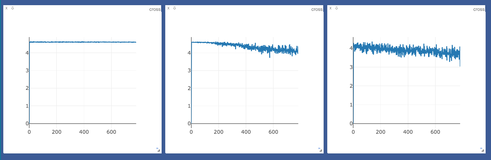

# CIFAR 100 Image Dataset Deep Learning

### Introduction
The CIFAR10 dataset is a group of images compiled for the purpose of deep learning. It consists of 60,000 32x32 images that can be categorized into 100 [classes](https://www.cs.toronto.edu/~kriz/cifar.html). This is an extension of our [CIFAR100](../CIFAR10) dataset classifier.

### Problem Statement

This classification problem is a great natural extension of the problems tackled when training a classifier for the MNIST dataset in previous assignments. We have a large group of images that should be classified into 100 different possible classes. The main differences and difficulties with the CIFAR dataset, however, is that it contains much more spatially complex images as well as 3 color input channels that must be accounted for when classifying.

### Solution - Network Architecturec

We tackle these difficulties by creating the first *convolutional* neural network of this semester. The first, and generally most simple architecture to use when beginning to learn about convolutional neural networks is LeNet. The layout of a typical LeNet neural network is as follows:

* 2D Convolutional Layer
* Maxpool Layer
* 2D Convolutional Layer
* Maxpool Layer
* Fully Connected Linear Layer
* Nonlinear Activation Function(ReLU)
* Fully Connected Linear Layer
* Nonlinear Activation Function(ReLU)
* Fully Connected Linear Layer

This network architecture is recreated in the current repository as a PyTorch neural network and was used to train the CIFAR 10 dataset. As before with our previous MNIST classifier, the program can be run by executing test.py after changing any desired parameters for output (visdom v. matplotlib graphing, mse v. crossentropy loss, and sgd v. adam optimizer). The final loss graphs can be seen below:

Accuracy for this network was found to be quite volatile. This can be seen in the relatively high loss after 3 epochs in the above image. This network is quite difficult to train on a conventional computer, given the architecture that we used for the network. Were we to increase our capabilities of the network by changing the architecture we may be able to get higher accuracy faster before we fry my MacBook :).
