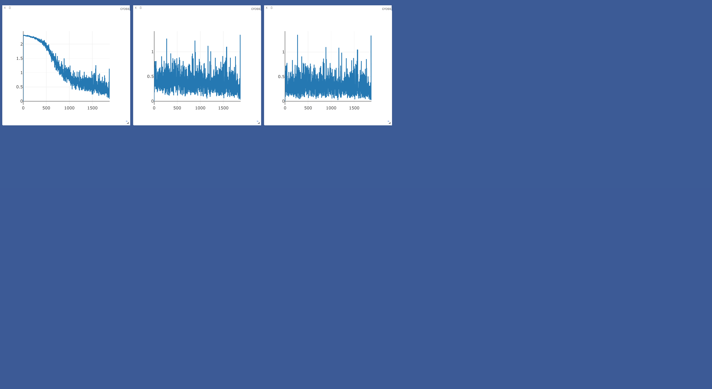

<h1>MNIST Dataset Fully Connected Linear Neural Network</h1>

<h3>Purpose of Assignment: </h3>

To utilize PyTorch's network architecture creation in order to create a simple fully-connected neural network and train it on the MNIST Handwritten Digits Dataset.

<h3>Introduction</h3>

There are two main user options that can be specificied for this assignment in the form of arguments passed to the train function in test.py: 

<ul>
    <li>loss_spec: either "mse" or "cross" to choose the loss function as either Cross Entropy Loss or Mean Squared Error Loss.</li>
    <li>plot_engine: Allows for either Visdom or Matplotlib to display loss minimization. "visdom" is more useful for live visualization so makes for a good development tool, while "matplotlib" allows for eaiser layout editing for the plots created.</li>
</ul>

Cross Entropy Loss visualized with Matplotlib

Mean Squared Error Loss visualized with Matplotlib

Cross Entropy Loss visualized with Visdom

Mean Squared Error Loss visualized with Visdom

